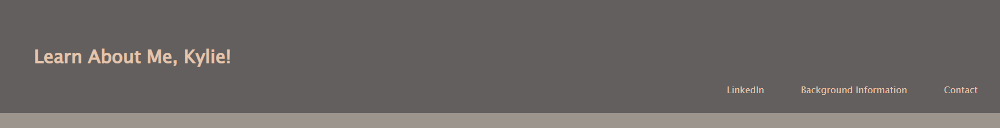

# Learn-About-Me

## Description
In this project, the expectation is to create a single webpage where the visitor is to input there contact information. The HTML file should contain semantic elements, universal class selectors, and a fixed header at the top of the page.
* There is to be a header  including three links to Contact Info, external link, and another link-in this case to the background info- that are all in line of each other. The page should jumpe directly to the contact info or background info when clicked on.

* The webpage is to have a footer.
* There is an image with a relevant caption.
* There is a contact for at the end of the page, providing name, email, an a submit button.

* The page should be properly deployed through Github

## Languages Used
* HTML
* CSS
